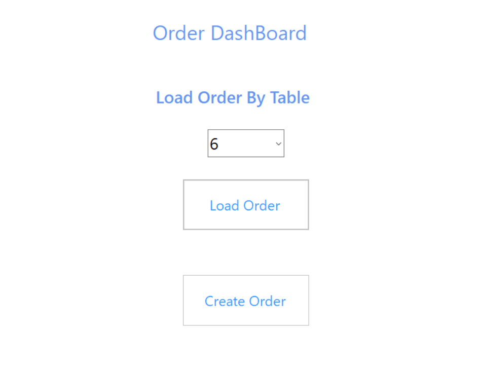
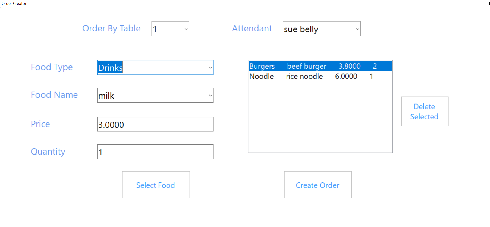
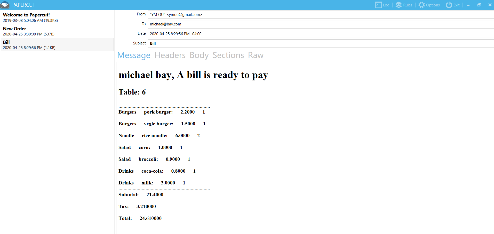
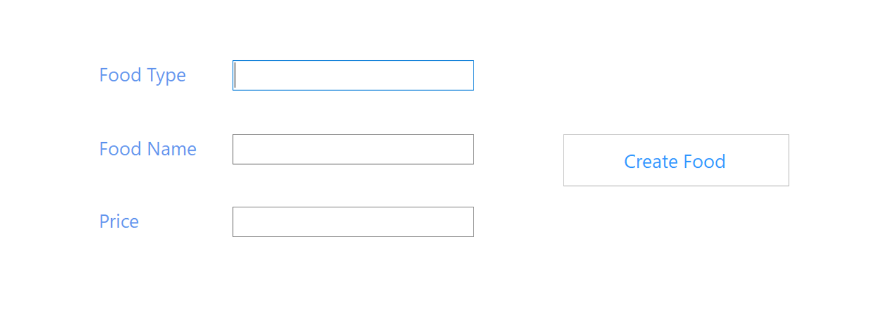
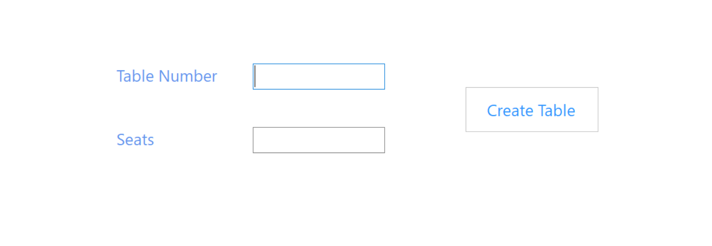
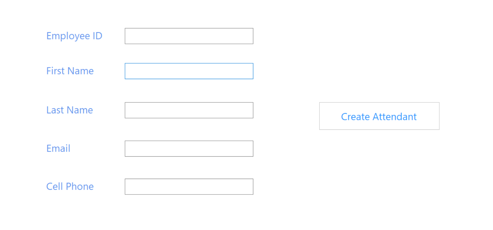

# Restaurant Ordering System (C# .NET Framework)

<ul>
  <li> A Desktop App that allows users to manage the employees, orders, food and dining tables in the restaurant. </li>
  <li> Front-end was implemented with Windows Forms that could send Order and Bill emails using the Simple Mail Transfer Protocol (<strong>SMTP</strong>). </li>
  <li> Back-end data access and storage was implemented with Microsoft SQL database using Dapper. </li>
</ul>

<h3> In the entry interface each button-click will display the corresponding form for further management. </h3>

<h3> Order Dashboard allows loading order info for the chosen dining table or display form for creating order. </h3>

<h3> Create Order form: the "Food Name" drop-down only displays food that belongs to the chosen "Food Type". After filling in required food info the "Select Food" button will add food to the list-box while the "Delete selected" button will delete the selected food from the list-box. Clicking the "Create" button will send order details to the chef for preparing food. </h3>

<h3> Order Viewer shows details of the order based on dining tables. Clicking the "Pay Bill" button will email the bill to the attendant that served the table for collecting bills. </h3>

<h3> Use Papercut (a simplified SMTP server) to receive Bill messages. </h3>

<h3> Food Viewer form for creating new food in the SQL database. </h3>

<h3> Table Viewer form for creating new dining tables in the SQL database. </h3>

<h3> Attendant Viewer form for creating new employees in the SQL database. </h3>

