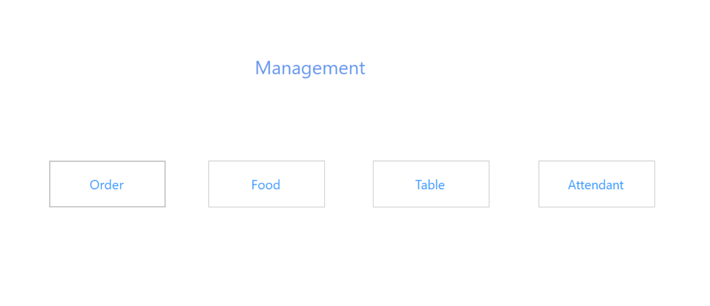
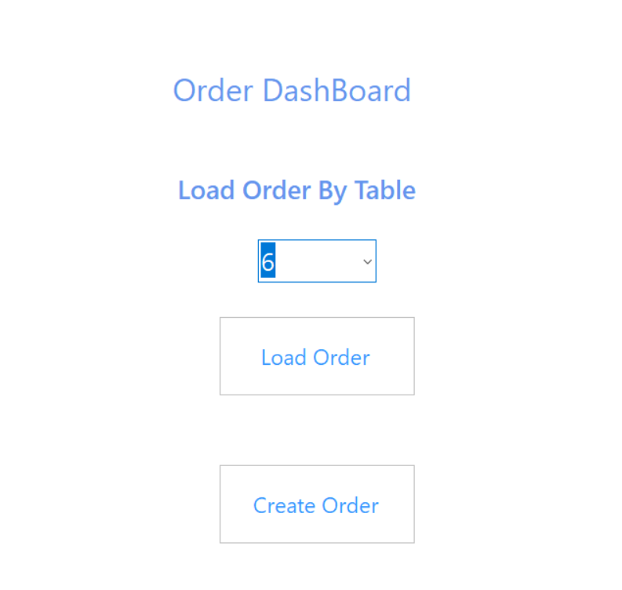
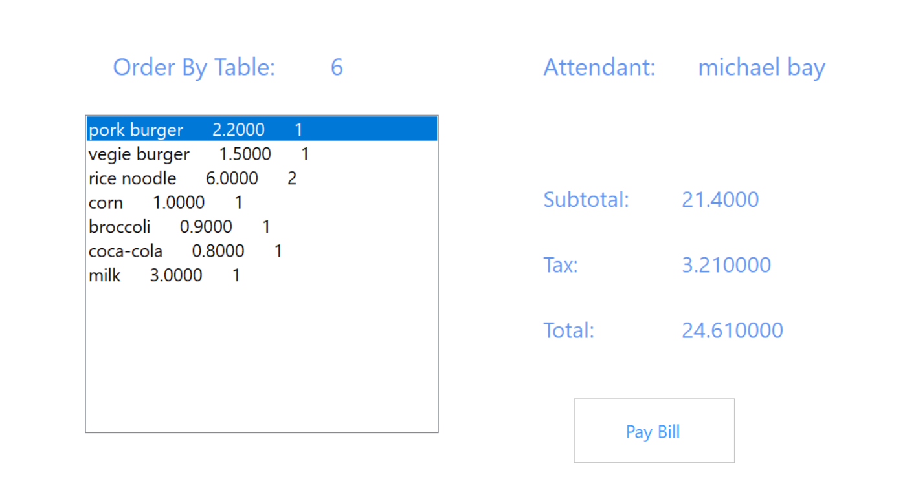
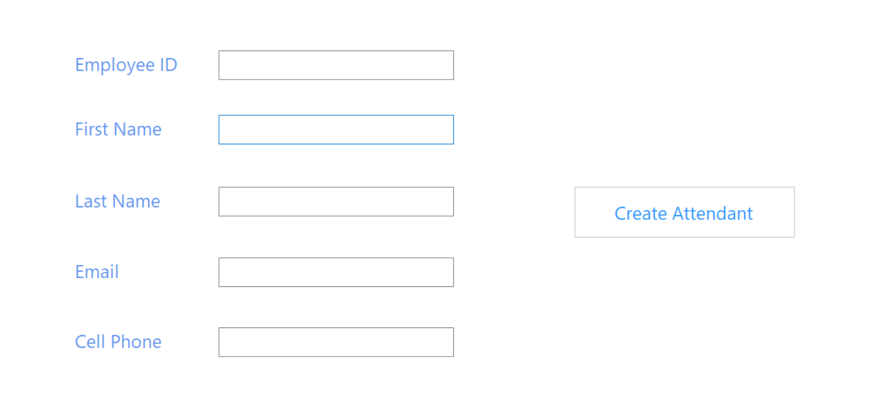

# Restaurant Ordering System -- a C# Windows Forms App (.NET Framework)

The OrderLibrary is a class library that contains class models for different objects and data access interface for storing and accessing data through SQL database.

The OrderUI implements the user interface using Windows Forms. 

Management Form is the entry interface for managing the orders, food, dining tables and employees in the restaurant.

Clicking the "order" button will display the Order Dashboard, which can be used to load the Create Order form with the "Create Order" button and send order details to the chef by email or load the Order Viewer form with the "Load Order" button to display the details of current orders based on dining tables and clicking the "Pay Bill" button will email the bill to the attendant that served that table.  

Clicking the "Food" button will display the Food Viewer form, which can be used to add new food to the database.

Clicking the "Table" button will display the Table Viewer form, which can be used to add new dining tables to the database.

Clicking the "Attendant" button will display the Attendant Viewer form, which can be used to add new employees to the database.

Management Form

Management Form

Management Form

Management Form

Management Form

Management Form

